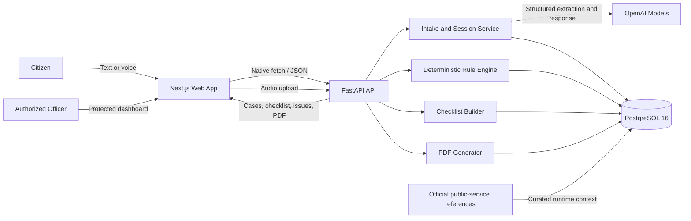
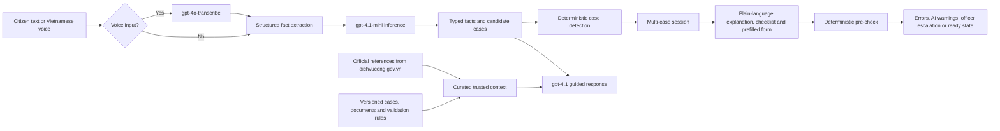

<!-- Replace the final project name, banner, demo links, screenshot, team details, and license before submission. -->

<!-- BANNER / LOGO HERE -->

<h1 align="center">CivicPath AI</h1>
<p align="center"><strong>AI-guided public service procedures — starting with birth registration</strong><br>Understand the procedure. Prepare the right documents. Check before you submit.</p>

<p align="center">
  <a href="#testing"></a>
  
  <a href="https://nextjs.org/"></a>
  <a href="https://fastapi.tiangolo.com/"></a>
  <a href="https://www.postgresql.org/"></a>
  <a href="https://openai.com/"></a>
  <a href="#license"></a>
</p>

<p align="center"><a href="https://git.io/typing-svg"></a></p>

<h2 align="center">🚀 <a href="[LINK DEMO]">LIVE DEMO</a> &nbsp;|&nbsp; 🎥 <a href="[VIDEO]">VIDEO DEMO</a></h2>

<!-- SCREENSHOT HERE -->

> 🖼️ Replace **[SCREENSHOT]** with a product screenshot or a short, optimized GIF showing: conversation → checklist → pre-check → PDF.

---

## 💡 Problem Statement

Public service procedures are often difficult for citizens to complete correctly on the first attempt:

- **Unclear preparation:** people do not know which documents, forms, or authority apply to their situation.
- **Late error discovery:** missing or conflicting information is often found only after an officer reviews the application.
- **Limited support capacity:** high question volume and limited staff lead to repeated visits, long queues, and avoidable delays.

Birth registration is the first procedure implemented deeply in this prototype. The underlying approach is designed to extend to other public services without forcing citizens to install another application.

## ✨ Solution

**CivicPath AI** turns an everyday conversation into a clear, case-aware preparation flow:

1. **Guided intake** — citizens describe their situation by text or Vietnamese voice input; AI asks one clear follow-up question at a time.
2. **Dynamic checklist** — the system detects one or multiple applicable cases and returns the exact documents and steps stored by the backend, including legal references.
3. **Pre-submission check** — deterministic rules identify missing fields and conflicts; AI rewrites explanations in plain language and flags uncertain exceptions for an officer.
4. **Prefilled application** — facts captured during the conversation automatically populate the form, leaving only missing information for the citizen to complete.
5. **Review and hand-off** — citizens can preview and download a PDF; authorized officers can review sessions through a protected, paginated dashboard.

> **Scope:** this prototype helps citizens prepare information. It does not issue an official birth certificate or replace the decision of a civil-status authority.

## 🏗️ Architecture



### AI Pipeline



### Responsible AI and Model Training

- **No custom model training or fine-tuning is used.**
- Default models are configurable: `gpt-4.1-mini` for structured classification, `gpt-4.1` for guided conversation, and `gpt-4o-transcribe` for Vietnamese speech-to-text.
- Official public-service pages are used as **curated runtime references**, not claimed as model training data.
- Mandatory errors come from the deterministic rule engine; AI wording never replaces the original legal basis.
- Rare, contradictory, or unsupported situations are marked: **“Requires direct confirmation from a civil-status officer.”**

## 🧰 Tech Stack

| Layer | Technology | Purpose |
|---|---|---|
| Frontend | Next.js 16, React 19, TypeScript 5.9 | Responsive citizen flow and officer dashboard |
| UI | Native HTML, CSS, Web APIs | Accessible forms, recording, animation, and zero UI-framework overhead |
| Backend | FastAPI, Pydantic | Typed REST API and OpenAPI contract |
| Data | PostgreSQL 16, SQLAlchemy 2, Alembic | Sessions, multi-case assignments, rules, documents, and migrations |
| AI | OpenAI Responses API | Structured extraction, plain-language guidance, and exception review |
| Speech | `gpt-4o-transcribe` | Vietnamese voice-to-text |
| PDF | ReportLab | Prefilled birth-registration form preview and download |
| Testing | Pytest, Node Test Runner, TypeScript | Backend rules, API helpers, frontend data normalization, and type safety |
| Local infrastructure | Docker Compose | Reproducible PostgreSQL setup |

## 🌟 Key Features

- 💬 **Plain-language intake** with one clear question at a time.
- 🎙️ **Vietnamese voice input** with transcript review before sending.
- 🧩 **Multi-case classification**, including combined cases such as unmarried parents and registration after 60 days.
- 📋 **Live document checklist** built from every applicable case without duplicate documents.
- ⚖️ **Evidence-first guidance** with backend-provided legal references.
- ✅ **Deterministic pre-check** for missing, invalid, and conflicting information.
- 🤖 **Clear AI warnings** separated from rule-engine errors.
- ✍️ **Conversation-to-form autofill** without overwriting fields edited by the citizen.
- 📄 **PDF preview and download** from the completed form.
- 🧑‍💼 **Protected officer dashboard** with filters, pagination, session review, update, delete, and authenticated PDF access.
- ♿ **Accessible and responsive UX** with semantic labels, keyboard support, focus states, and live status announcements.
- 🔌 **API-first design** suitable for future portal, widget, or chatbot integration.

## 🚀 Installation & Usage

### Prerequisites

- Node.js 20+
- Python 3.11+
- Docker and Docker Compose
- An OpenAI API key

### 1. Clone the repository

```bash
git clone https://github.com/dnphuc04/AI-guided-public-service-procedures-Lonely-Stone-.git
cd AI-guided-public-service-procedures-Lonely-Stone-
```

### 2. Start PostgreSQL

```bash
cd backend
docker compose up -d
```

### 3. Run the backend

```bash
cp .env.example .env
python3 -m venv .venv
source .venv/bin/activate
pip install -r requirements.txt
alembic upgrade head
uvicorn app.main:app --reload
```

Set at least the following value in `backend/.env` before starting:

```dotenv
OPENAI_API_KEY=your_openai_api_key
```

Optional officer access:

```dotenv
ADMIN_API_KEY=your_private_admin_access_code
```

Backend: `http://localhost:8000`<br>
Swagger UI: `http://localhost:8000/docs`

### 4. Run the frontend

Open a second terminal:

```bash
cd frontend
cp .env.example .env.local
npm ci
npm run dev
```

Citizen application: `http://localhost:3000`<br>
Officer dashboard: `http://localhost:3000/admin`

> Never expose `OPENAI_API_KEY` in the frontend. All AI requests must go through the backend.

<a id="testing"></a>

## 🧪 Testing

```bash
# Backend
cd backend
source .venv/bin/activate
pytest

# Frontend
cd ../frontend
npm test
npm run build
```

## 👥 Team — Lonely Stone

| Member | Role | Profile |
|---|---|---|
| `[TEAM MEMBER 1]` | `[ROLE]` | `[GITHUB / LINKEDIN]` |
| `[TEAM MEMBER 2]` | `[ROLE]` | `[GITHUB / LINKEDIN]` |
| `[TEAM MEMBER 3]` | `[ROLE]` | `[GITHUB / LINKEDIN]` |

<a id="license"></a>

## 📄 License

`[LICENSE]`

No license file is currently included. Choose and add the final license before publishing or redistributing the project.

---

<p align="center"><strong>Built for a smarter public-service experience: clearer for citizens, more manageable for officers.</strong></p>
