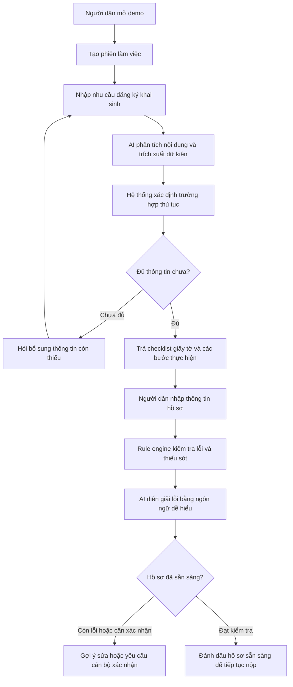
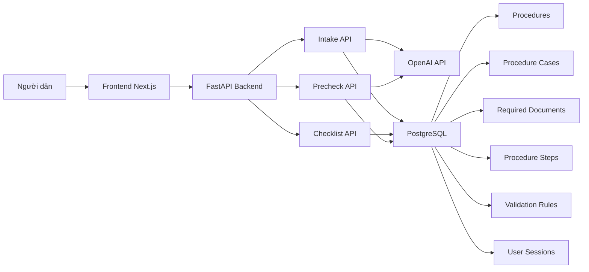

# AI-guided birth registration

**Vietnam AI Innovation Challenge | AI-guided public service procedures | Chính phủ số**

## Tóm tắt

AI-guided birth registration là bản demo trợ lý số hỗ trợ người dân thực hiện thủ tục đăng ký khai sinh. Sản phẩm giải quyết bài toán **AI-guided public service procedures** trong lĩnh vực **Chính phủ số** bằng cách kết hợp dữ liệu thủ tục hành chính công, rule engine và mô hình AI để hướng dẫn người dân theo từng trường hợp cụ thể.

Demo hướng tới một quy trình thực tế, không phải mockup: người dân nhập nhu cầu bằng ngôn ngữ tự nhiên, hệ thống xác định trường hợp thủ tục, trả về danh sách giấy tờ và các bước cần làm, sau đó kiểm tra thông tin hồ sơ đã điền để phát hiện lỗi hoặc thiếu sót trước khi nộp.

Nguồn dữ liệu của dự án được lấy từ Cổng Dịch vụ công Quốc gia, đặc biệt là mục tra cứu thủ tục hành chính tại [https://dichvucong.gov.vn/thu-tuc-hanh-chinh](https://dichvucong.gov.vn/thu-tuc-hanh-chinh). Các file hướng dẫn thủ tục và mẫu đơn hành chính trong dự án bao gồm tài liệu mô tả chi tiết thủ tục, thành phần hồ sơ, trình tự thực hiện và biểu mẫu đi kèm.

## Mục tiêu sản phẩm

Sản phẩm được thiết kế để giúp người dân không chuyên về kỹ thuật có thể hiểu và chuẩn bị hồ sơ đăng ký khai sinh một cách rõ ràng hơn. Thay vì phải tự đọc nhiều văn bản thủ tục, người dân có thể mô tả nhu cầu của mình, nhận hướng dẫn phù hợp với tình huống cá nhân và kiểm tra trước hồ sơ nháp.

Hệ thống không thay thế vai trò thẩm định của cán bộ nhà nước. Với các trường hợp đặc biệt hoặc chưa đủ căn cứ xác định, hệ thống đánh dấu cần cán bộ hộ tịch xác nhận trực tiếp.

## Phạm vi demo cần bàn giao

Bản demo cần được triển khai thành một hệ thống hoạt động thực tế và có thể truy cập qua URL công khai. Quy trình người dùng tối thiểu gồm ba bước:

1. **Nhập nhu cầu:** người dân mô tả tình huống đăng ký khai sinh bằng tiếng Việt tự nhiên.
2. **Nhận hướng dẫn từng bước:** hệ thống phân loại trường hợp, hiển thị danh sách giấy tờ cần chuẩn bị và các bước thực hiện.
3. **Kiểm tra thông tin đã điền:** người dân nhập dữ liệu hồ sơ, hệ thống phát hiện trường thiếu, lỗi logic hoặc điều kiện cần bổ sung.

Repo hiện bao gồm:

- `frontend/`: giao diện Next.js + TypeScript cho luồng hướng dẫn người dùng.
- `backend/`: API FastAPI, PostgreSQL, Alembic migration, rule engine và tích hợp OpenAI.
- `raw/` và `data/raw/`: tài liệu thủ tục, file hướng dẫn và mẫu đơn được thu thập từ nguồn dịch vụ công.

## Luồng hoạt động



## Kiến trúc hệ thống



Frontend cung cấp trải nghiệm nhập nhu cầu, xem hướng dẫn và kiểm tra hồ sơ. Backend điều phối toàn bộ logic nghiệp vụ, bao gồm quản lý phiên làm việc, phân loại trường hợp, tạo checklist và kiểm tra dữ liệu hồ sơ. PostgreSQL lưu dữ liệu thủ tục, biểu mẫu, luật kiểm tra và lịch sử phiên. OpenAI được dùng để hiểu ngôn ngữ tự nhiên, hỗ trợ phân loại trường hợp và diễn giải lỗi theo cách thân thiện với người dân.

## Mô hình dữ liệu chính

- `Procedure`: thông tin thủ tục hành chính, ví dụ thủ tục đăng ký khai sinh.
- `ProcedureCase`: các trường hợp nghiệp vụ như đăng ký thông thường, quá hạn, có yếu tố nước ngoài, nhận cha mẹ con, đăng ký lại hoặc chỉnh sửa hộ tịch.
- `RequiredDocument`: giấy tờ cần chuẩn bị theo từng thủ tục và từng trường hợp.
- `ProcedureStep`: các bước thực hiện thủ tục.
- `ValidationRule`: luật kiểm tra thông tin hồ sơ.
- `UserSession`: phiên làm việc của người dân.
- `SessionMessage`: lịch sử hội thoại giữa người dân và trợ lý.
- `SessionFormData`: dữ liệu hồ sơ đã trích xuất hoặc người dân đã nhập.
- `PrecheckResult`: kết quả kiểm tra hồ sơ, gồm lỗi, cảnh báo và gợi ý sửa.

## API chính

| API | Mục đích |
| --- | --- |
| `GET /health` | Kiểm tra trạng thái backend |
| `POST /sessions` | Tạo phiên làm việc mới cho người dân |
| `POST /intake/message` | Nhận nhu cầu người dùng, phân loại trường hợp và hỏi bổ sung nếu thiếu thông tin |
| `GET /checklist/{session_id}` | Trả về danh sách giấy tờ và các bước thực hiện theo trường hợp đã xác định |
| `POST /precheck` | Kiểm tra dữ liệu hồ sơ đã điền và trả về lỗi/cảnh báo |
| `GET /sessions/{session_id}` | Xem lại toàn bộ phiên, hội thoại, dữ liệu đã nhập và kết quả kiểm tra |

## Mô hình và công nghệ sử dụng

- **Frontend:** Next.js, React, TypeScript.
- **Backend:** FastAPI, SQLAlchemy, Alembic.
- **Database:** PostgreSQL.
- **AI:** OpenAI API cho hội thoại, phân loại trường hợp, trích xuất thông tin và diễn giải lỗi.
- **Rule engine:** kiểm tra xác định dựa trên luật nghiệp vụ lưu trong cơ sở dữ liệu.
- **Dữ liệu nguồn:** tài liệu thủ tục hành chính và mẫu đơn từ Cổng Dịch vụ công Quốc gia tại [https://dichvucong.gov.vn/thu-tuc-hanh-chinh](https://dichvucong.gov.vn/thu-tuc-hanh-chinh), cùng danh mục biểu mẫu hành chính được phân loại theo lĩnh vực.

## Tiêu chí đánh giá

### 1. Độ chính xác và đầy đủ của hướng dẫn

Hướng dẫn cần bám sát dữ liệu thủ tục hành chính hiện hành, bao gồm thành phần hồ sơ, trình tự thực hiện, trường hợp đặc biệt và căn cứ pháp lý khi có. Checklist được sinh từ dữ liệu thủ tục và trường hợp cụ thể của người dân, tránh hiển thị một danh sách chung chung.

### 2. Khả năng phát hiện lỗi và thiếu sót

Hệ thống sử dụng rule engine để kiểm tra các trường bắt buộc, điều kiện theo từng trường hợp và các lỗi logic trong hồ sơ. AI hỗ trợ diễn giải lỗi bằng ngôn ngữ dễ hiểu, nhưng các kiểm tra cốt lõi được thực hiện bằng luật xác định để tăng tính ổn định và khả năng kiểm chứng.

### 3. Khả năng tích hợp vào hệ thống dịch vụ công

Kiến trúc API tách biệt frontend, backend và cơ sở dữ liệu, phù hợp để tích hợp với các cổng dịch vụ công hoặc hệ thống một cửa hiện có. Lộ trình thí điểm nên bắt đầu với thủ tục đăng ký khai sinh, sau đó mở rộng sang các thủ tục hộ tịch khác và các nhóm thủ tục hành chính có biểu mẫu chuẩn hóa.

### 4. Trải nghiệm người dùng

Sản phẩm ưu tiên người dân không chuyên về kỹ thuật. Người dùng có thể mô tả nhu cầu bằng tiếng Việt tự nhiên, nhận hướng dẫn rõ ràng, biết mình còn thiếu thông tin nào và được gợi ý cách sửa hồ sơ trước khi nộp.

## Tóm tắt một trang trình bày

**Vấn đề:** Người dân gặp khó khăn khi tự tìm hiểu thủ tục hành chính do thông tin phân tán, nhiều trường hợp ngoại lệ và yêu cầu hồ sơ dễ bị thiếu hoặc sai.

**Giải pháp:** AI-guided birth registration cung cấp trợ lý hướng dẫn đăng ký khai sinh, kết hợp dữ liệu thủ tục công, rule engine và OpenAI để cá nhân hóa hướng dẫn theo từng tình huống.

**Đối tượng người dùng:** Người dân thực hiện thủ tục hộ tịch, đặc biệt là đăng ký khai sinh; cán bộ tiếp nhận hồ sơ có thể dùng kết quả kiểm tra trước để giảm hồ sơ thiếu/sai.

**Lộ trình triển khai:** triển khai demo công khai, thí điểm với thủ tục đăng ký khai sinh, tích hợp với hệ thống dịch vụ công hiện có, sau đó mở rộng sang các thủ tục hộ tịch và nhóm thủ tục hành chính khác.

## Chạy local

### Backend

```bash
cd backend
cp .env.example .env
docker compose up -d
python -m venv .venv
source .venv/bin/activate
pip install -r requirements.txt
alembic upgrade head
uvicorn app.main:app --reload
```

Swagger UI: `http://localhost:8000/docs`

### Frontend

```bash
cd frontend
cp .env.example .env.local
npm install
npm run dev
```

Frontend local: `http://localhost:3000`

## Kiểm thử

### Backend

```bash
cd backend
pytest
```

### Frontend

```bash
cd frontend
npm test
```
