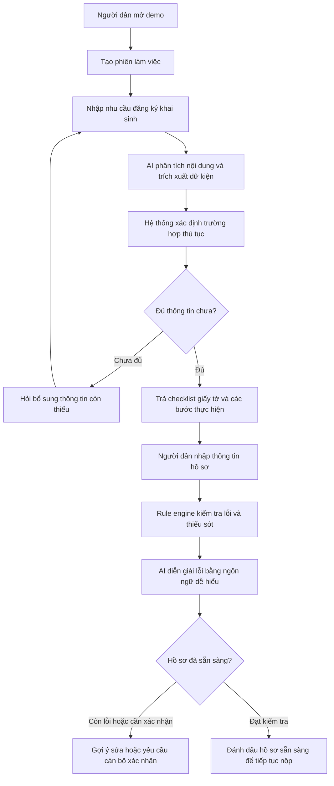
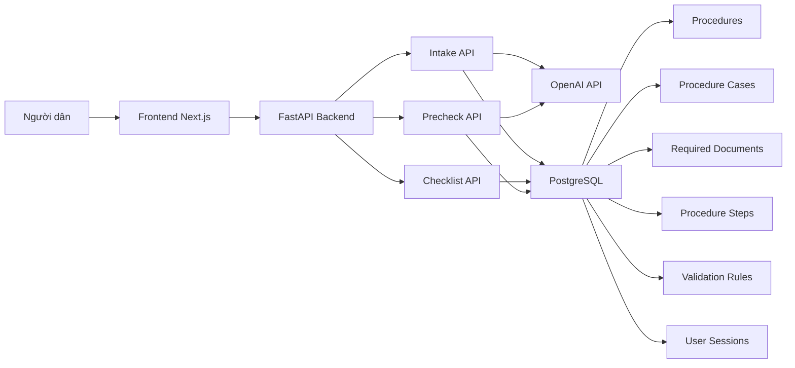
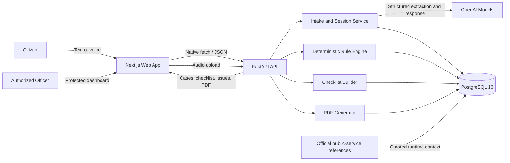
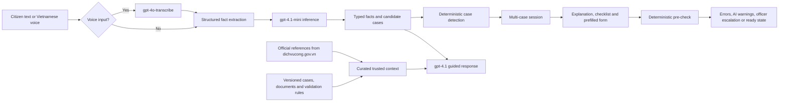

<<<<<<< HEAD
<!-- Replace the final project name, banner, demo links, screenshot, team details, and license before submission. -->

<!-- BANNER / LOGO HERE -->
=======
# AI-guided birth registration

**Vietnam AI Innovation Challenge | AI-guided public service procedures | Chính phủ số**

## Tóm tắt

AI-guided birth registration là bản demo trợ lý số hỗ trợ người dân thực hiện thủ tục đăng ký khai sinh. Sản phẩm giải quyết bài toán **AI-guided public service procedures** trong lĩnh vực **Chính phủ số** bằng cách kết hợp dữ liệu thủ tục hành chính công, rule engine và mô hình AI để hướng dẫn người dân theo từng trường hợp cụ thể.

Demo hướng tới một quy trình thực tế, không phải mockup: người dân nhập nhu cầu bằng ngôn ngữ tự nhiên, hệ thống xác định trường hợp thủ tục, trả về danh sách giấy tờ và các bước cần làm, sau đó kiểm tra thông tin hồ sơ đã điền để phát hiện lỗi hoặc thiếu sót trước khi nộp.

Nguồn dữ liệu của dự án được lấy từ Cổng Dịch vụ công Quốc gia, đặc biệt là mục tra cứu thủ tục hành chính tại [https://dichvucong.gov.vn/thu-tuc-hanh-chinh](https://dichvucong.gov.vn/thu-tuc-hanh-chinh). Các file hướng dẫn thủ tục và mẫu đơn hành chính trong dự án bao gồm tài liệu mô tả chi tiết thủ tục, thành phần hồ sơ, trình tự thực hiện và biểu mẫu đi kèm.

## Mục tiêu sản phẩm

Sản phẩm được thiết kế để giúp người dân không chuyên về kỹ thuật có thể hiểu và chuẩn bị hồ sơ đăng ký khai sinh một cách rõ ràng hơn. Thay vì phải tự đọc nhiều văn bản thủ tục, người dân có thể mô tả nhu cầu của mình, nhận hướng dẫn phù hợp với tình huống cá nhân và kiểm tra trước hồ sơ nháp.

Hệ thống không thay thế vai trò thẩm định của cán bộ nhà nước. Với các trường hợp đặc biệt hoặc chưa đủ căn cứ xác định, hệ thống đánh dấu cần cán bộ hộ tịch xác nhận trực tiếp.

## Phạm vi demo cần bàn giao

Bản demo cần được triển khai thành một hệ thống hoạt động thực tế và có thể truy cập qua URL công khai. Quy trình người dùng tối thiểu gồm ba bước:

1. **Nhập nhu cầu:** người dân mô tả tình huống đăng ký khai sinh bằng tiếng Việt tự nhiên.
2. **Nhận hướng dẫn từng bước:** hệ thống phân loại trường hợp, hiển thị danh sách giấy tờ cần chuẩn bị và các bước thực hiện.
3. **Kiểm tra thông tin đã điền:** người dân nhập dữ liệu hồ sơ, hệ thống phát hiện trường thiếu, lỗi logic hoặc điều kiện cần bổ sung.

Repo hiện bao gồm:

- `frontend/`: giao diện Next.js + TypeScript cho luồng hướng dẫn người dùng.
- `backend/`: API FastAPI, PostgreSQL, Alembic migration, rule engine và tích hợp OpenAI.
- `raw/` và `data/raw/`: tài liệu thủ tục, file hướng dẫn và mẫu đơn được thu thập từ nguồn dịch vụ công.

## Luồng hoạt động



## Kiến trúc hệ thống



Frontend cung cấp trải nghiệm nhập nhu cầu, xem hướng dẫn và kiểm tra hồ sơ. Backend điều phối toàn bộ logic nghiệp vụ, bao gồm quản lý phiên làm việc, phân loại trường hợp, tạo checklist và kiểm tra dữ liệu hồ sơ. PostgreSQL lưu dữ liệu thủ tục, biểu mẫu, luật kiểm tra và lịch sử phiên. OpenAI được dùng để hiểu ngôn ngữ tự nhiên, hỗ trợ phân loại trường hợp và diễn giải lỗi theo cách thân thiện với người dân.

## Mô hình dữ liệu chính

- `Procedure`: thông tin thủ tục hành chính, ví dụ thủ tục đăng ký khai sinh.
- `ProcedureCase`: các trường hợp nghiệp vụ như đăng ký thông thường, quá hạn, có yếu tố nước ngoài, nhận cha mẹ con, đăng ký lại hoặc chỉnh sửa hộ tịch.
- `RequiredDocument`: giấy tờ cần chuẩn bị theo từng thủ tục và từng trường hợp.
- `ProcedureStep`: các bước thực hiện thủ tục.
- `ValidationRule`: luật kiểm tra thông tin hồ sơ.
- `UserSession`: phiên làm việc của người dân.
- `SessionMessage`: lịch sử hội thoại giữa người dân và trợ lý.
- `SessionFormData`: dữ liệu hồ sơ đã trích xuất hoặc người dân đã nhập.
- `PrecheckResult`: kết quả kiểm tra hồ sơ, gồm lỗi, cảnh báo và gợi ý sửa.

## API chính

| API | Mục đích |
| --- | --- |
| `GET /health` | Kiểm tra trạng thái backend |
| `POST /sessions` | Tạo phiên làm việc mới cho người dân |
| `POST /intake/message` | Nhận nhu cầu người dùng, phân loại trường hợp và hỏi bổ sung nếu thiếu thông tin |
| `GET /checklist/{session_id}` | Trả về danh sách giấy tờ và các bước thực hiện theo trường hợp đã xác định |
| `POST /precheck` | Kiểm tra dữ liệu hồ sơ đã điền và trả về lỗi/cảnh báo |
| `GET /sessions/{session_id}` | Xem lại toàn bộ phiên, hội thoại, dữ liệu đã nhập và kết quả kiểm tra |

## Mô hình và công nghệ sử dụng

- **Frontend:** Next.js, React, TypeScript.
- **Backend:** FastAPI, SQLAlchemy, Alembic.
- **Database:** PostgreSQL.
- **AI:** OpenAI API cho hội thoại, phân loại trường hợp, trích xuất thông tin và diễn giải lỗi.
- **Rule engine:** kiểm tra xác định dựa trên luật nghiệp vụ lưu trong cơ sở dữ liệu.
- **Dữ liệu nguồn:** tài liệu thủ tục hành chính và mẫu đơn từ Cổng Dịch vụ công Quốc gia tại [https://dichvucong.gov.vn/thu-tuc-hanh-chinh](https://dichvucong.gov.vn/thu-tuc-hanh-chinh), cùng danh mục biểu mẫu hành chính được phân loại theo lĩnh vực.

## Tiêu chí đánh giá

### 1. Độ chính xác và đầy đủ của hướng dẫn

Hướng dẫn cần bám sát dữ liệu thủ tục hành chính hiện hành, bao gồm thành phần hồ sơ, trình tự thực hiện, trường hợp đặc biệt và căn cứ pháp lý khi có. Checklist được sinh từ dữ liệu thủ tục và trường hợp cụ thể của người dân, tránh hiển thị một danh sách chung chung.

### 2. Khả năng phát hiện lỗi và thiếu sót

Hệ thống sử dụng rule engine để kiểm tra các trường bắt buộc, điều kiện theo từng trường hợp và các lỗi logic trong hồ sơ. AI hỗ trợ diễn giải lỗi bằng ngôn ngữ dễ hiểu, nhưng các kiểm tra cốt lõi được thực hiện bằng luật xác định để tăng tính ổn định và khả năng kiểm chứng.

### 3. Khả năng tích hợp vào hệ thống dịch vụ công

Kiến trúc API tách biệt frontend, backend và cơ sở dữ liệu, phù hợp để tích hợp với các cổng dịch vụ công hoặc hệ thống một cửa hiện có. Lộ trình thí điểm nên bắt đầu với thủ tục đăng ký khai sinh, sau đó mở rộng sang các thủ tục hộ tịch khác và các nhóm thủ tục hành chính có biểu mẫu chuẩn hóa.

### 4. Trải nghiệm người dùng

Sản phẩm ưu tiên người dân không chuyên về kỹ thuật. Người dùng có thể mô tả nhu cầu bằng tiếng Việt tự nhiên, nhận hướng dẫn rõ ràng, biết mình còn thiếu thông tin nào và được gợi ý cách sửa hồ sơ trước khi nộp.

## Tóm tắt một trang trình bày

**Vấn đề:** Người dân gặp khó khăn khi tự tìm hiểu thủ tục hành chính do thông tin phân tán, nhiều trường hợp ngoại lệ và yêu cầu hồ sơ dễ bị thiếu hoặc sai.

**Giải pháp:** AI-guided birth registration cung cấp trợ lý hướng dẫn đăng ký khai sinh, kết hợp dữ liệu thủ tục công, rule engine và OpenAI để cá nhân hóa hướng dẫn theo từng tình huống.

**Đối tượng người dùng:** Người dân thực hiện thủ tục hộ tịch, đặc biệt là đăng ký khai sinh; cán bộ tiếp nhận hồ sơ có thể dùng kết quả kiểm tra trước để giảm hồ sơ thiếu/sai.

**Lộ trình triển khai:** triển khai demo công khai, thí điểm với thủ tục đăng ký khai sinh, tích hợp với hệ thống dịch vụ công hiện có, sau đó mở rộng sang các thủ tục hộ tịch và nhóm thủ tục hành chính khác.
>>>>>>> 5de8d9179a36d2770b390b216bb50441e6d47aec

<h1 align="center">CivicPath AI</h1>
<p align="center"><strong>AI-guided public service procedures — starting with birth registration</strong><br>Understand the procedure. Prepare the right documents. Check before you submit.</p>

<p align="center">
  <a href="#testing"></a>
  
  <a href="https://nextjs.org/"></a>
  <a href="https://fastapi.tiangolo.com/"></a>
  <a href="https://www.postgresql.org/"></a>
  <a href="https://openai.com/"></a>
  <a href="#license"></a>
</p>

<p align="center"><a href="https://git.io/typing-svg"></a></p>

<h2 align="center">🚀 <a href="[LINK DEMO]">LIVE DEMO</a> &nbsp;|&nbsp; 🎥 <a href="[VIDEO]">VIDEO DEMO</a></h2>

<!-- SCREENSHOT HERE -->

> 🖼️ Replace **[SCREENSHOT]** with a product screenshot or an optimized GIF showing: conversation → checklist → pre-check → PDF.

---

## 💡 Problem Statement

Citizens completing public-service procedures commonly face three obstacles:

- **Unclear preparation:** they do not know which documents, forms, or authority apply to their situation.
- **Late error discovery:** missing or conflicting information is often found only after an officer reviews the application.
- **Limited support capacity:** high question volume and limited staff lead to repeated visits, long queues, and avoidable delays.

Birth registration is the first procedure implemented deeply in this prototype. The approach is designed to extend to other public services without requiring citizens to install another application.

## ✨ Solution

**CivicPath AI** turns an everyday conversation into a clear, case-aware preparation flow:

1. **Guided intake** — citizens describe their situation by text or Vietnamese voice input; AI asks one clear follow-up question at a time.
2. **Dynamic checklist** — the system detects one or multiple applicable cases and returns the documents and steps stored by the backend, including legal references.
3. **Pre-submission check** — deterministic rules identify missing fields and conflicts; AI explains issues in plain language and flags uncertain exceptions for an officer.
4. **Prefilled application** — facts captured during the conversation automatically populate the form, leaving only missing information to complete.
5. **Review and hand-off** — citizens preview and download a PDF; authorized officers review sessions through a protected, paginated dashboard.

> **Scope:** this prototype helps citizens prepare information. It does not issue an official birth certificate or replace the decision of a civil-status authority.

## 🏗️ Architecture



### AI Pipeline



### Responsible AI and Model Training

- **No custom model training or fine-tuning is used.**
- Default models are configurable: `gpt-4.1-mini` for structured classification, `gpt-4.1` for guided conversation, and `gpt-4o-transcribe` for Vietnamese speech-to-text.
- Official public-service pages are used as **curated runtime references**, not claimed as model training data.
- Mandatory errors come from the deterministic rule engine; AI wording never replaces the original legal basis.
- Rare, contradictory, or unsupported situations are escalated for direct confirmation by a civil-status officer.

## 🧰 Tech Stack

| Layer | Technology | Purpose |
|---|---|---|
| Frontend | Next.js 16, React 19, TypeScript 5.9 | Responsive citizen flow and officer dashboard |
| UI | Native HTML, CSS, Web APIs | Accessible forms, recording, and animation without a UI framework |
| Backend | FastAPI, Pydantic | Typed REST API and OpenAPI contract |
| Data | PostgreSQL 16, SQLAlchemy 2, Alembic | Sessions, cases, rules, documents, and migrations |
| AI | OpenAI Responses API | Structured extraction, guidance, and exception review |
| Speech | `gpt-4o-transcribe` | Vietnamese voice-to-text |
| PDF | ReportLab | Prefilled form preview and download |
| Testing | Pytest, Node Test Runner, TypeScript | Backend rules, frontend normalization, and type safety |
| Infrastructure | Docker Compose | Reproducible local PostgreSQL setup |

## 🌟 Key Features

- 💬 **Plain-language intake** with one clear question at a time.
- 🎙️ **Vietnamese voice input** with transcript review before sending.
- 🧩 **Multi-case classification**, including combined cases such as unmarried parents and registration after 60 days.
- 📋 **Live document checklist** built from every applicable case without duplicate documents.
- ⚖️ **Evidence-first guidance** with backend-provided legal references.
- ✅ **Deterministic pre-check** for missing, invalid, and conflicting information.
- 🤖 **Clear AI warnings** separated from rule-engine errors.
- ✍️ **Conversation-to-form autofill** without overwriting fields edited by the citizen.
- 📄 **PDF preview and download** from the completed form.
- 🧑‍💼 **Protected officer dashboard** with filters, pagination, session review, update, delete, and authenticated PDF access.
- ♿ **Accessible and responsive UX** with keyboard support, focus states, and live status announcements.
- 🔌 **API-first design** suitable for future portal, widget, or chatbot integration.

## 🔌 Core API

| Endpoint | Purpose |
|---|---|
| `GET /health` | Check backend availability |
| `POST /sessions` | Create a citizen guidance session |
| `POST /intake/message` | Extract facts, classify cases, and return the next guidance message |
| `POST /intake/audio` | Transcribe Vietnamese voice input |
| `GET /checklist/{session_id}` | Return case-aware documents and steps |
| `POST /precheck` | Validate the completed form and return errors or warnings |
| `GET /sessions/{session_id}` | Restore chat, cases, form data, and pre-check results |
| `GET /sessions/{session_id}/birth-registration.pdf` | Preview or download the generated PDF |
| `GET /trust` | Return official source links and AI-method disclosure |

Interactive API documentation is available at `http://localhost:8000/docs` when the backend is running.

## 🚀 Installation & Usage

### Prerequisites

- Node.js 20+
- Python 3.11+
- Docker and Docker Compose
- An OpenAI API key

### 1. Clone the repository

```bash
git clone https://github.com/dnphuc04/AI-guided-public-service-procedures-Lonely-Stone-.git
cd AI-guided-public-service-procedures-Lonely-Stone-
```

### 2. Start PostgreSQL

```bash
cd backend
docker compose up -d
```

### 3. Run the backend

```bash
cp .env.example .env
python3 -m venv .venv
source .venv/bin/activate
pip install -r requirements.txt
alembic upgrade head
uvicorn app.main:app --reload
```

Set at least the following value in `backend/.env` before starting:

```dotenv
OPENAI_API_KEY=your_openai_api_key
```

Optional officer access:

```dotenv
ADMIN_API_KEY=your_private_admin_access_code
```

Backend: `http://localhost:8000`<br>
Swagger UI: `http://localhost:8000/docs`

### 4. Run the frontend

Open a second terminal from the repository root:

```bash
cd frontend
cp .env.example .env.local
npm ci
npm run dev
```

Citizen application: `http://localhost:3000`<br>
Officer dashboard: `http://localhost:3000/admin`

> Never expose `OPENAI_API_KEY` in the frontend. All AI requests must go through the backend.

<a id="testing"></a>

## 🧪 Testing

```bash
# Backend
cd backend
source .venv/bin/activate
pytest

# Frontend
cd ../frontend
npm test
npm run build
```

## 🗺️ Pilot Roadmap

- **Phase 1 — Birth-registration pilot:** deploy the current flow with one local civil-status office and measure completion rate, pre-check errors, and repeated visits.
- **Phase 2 — Portal integration:** embed the experience through the REST API or a lightweight widget and collect structured officer feedback.
- **Phase 3 — Procedure expansion:** reuse the architecture for additional civil-status services, then evaluate household registration and building permits.

## 👥 Team — Lonely Stone

| Member | Role | Profile |
|---|---|---|
| `[TEAM MEMBER 1]` | `[ROLE]` | `[GITHUB / LINKEDIN]` |
| `[TEAM MEMBER 2]` | `[ROLE]` | `[GITHUB / LINKEDIN]` |
| `[TEAM MEMBER 3]` | `[ROLE]` | `[GITHUB / LINKEDIN]` |

<a id="license"></a>

## 📄 License

`[LICENSE]`

No license file is currently included. Choose and add the final license before publishing or redistributing the project.

---

<p align="center"><strong>Built for a smarter public-service experience: clearer for citizens, more manageable for officers.</strong></p>
