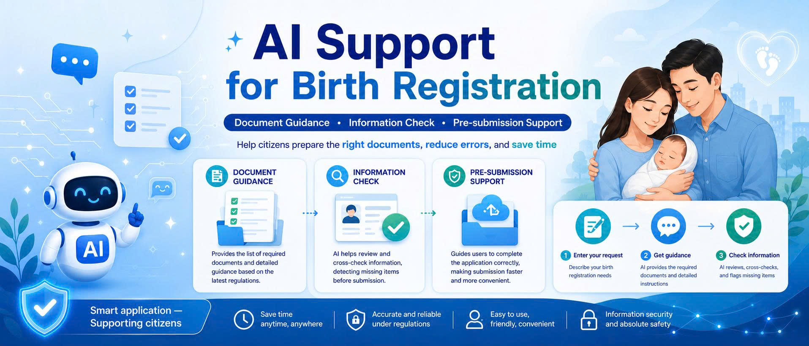
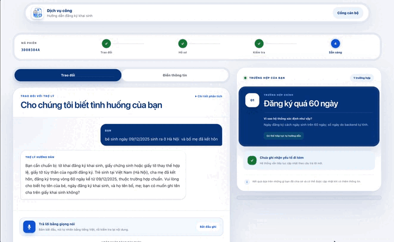
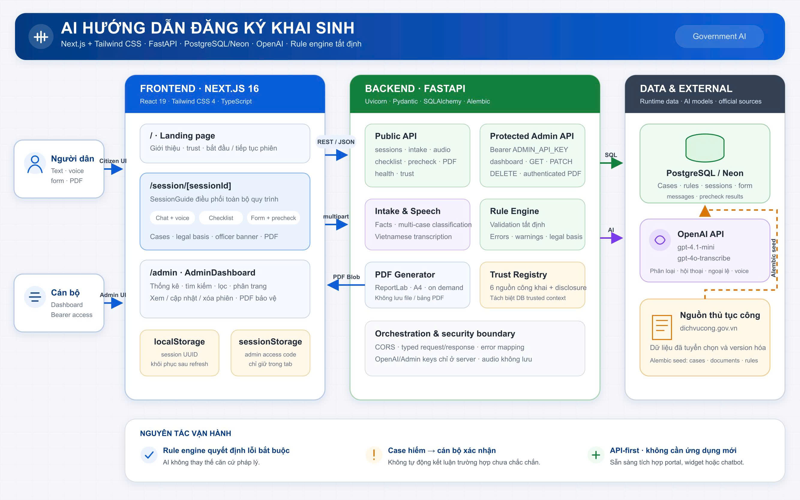
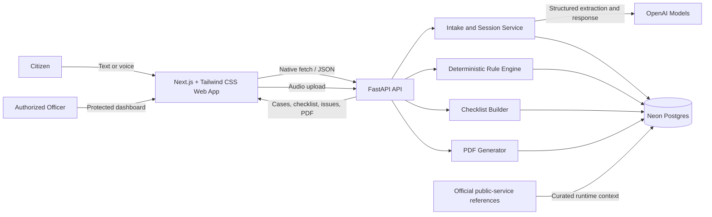
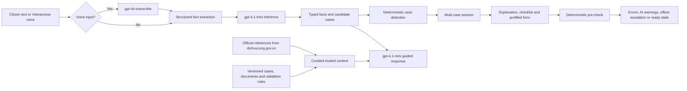

<p align="center"><a href="https://ai-guided-public-service-procedures.vercel.app/"></a></p>

<p align="center"><a href="https://ai-guided-public-service-procedures.vercel.app/"></a></p>

<h1 align="center">CivicPath AI</h1>
<p align="center"><strong>AI-guided public service procedures — starting with birth registration</strong><br>Understand the procedure. Prepare the right documents. Check before you submit.</p>

<div align="center">
  <h3>🏛️ Hackathon AI INNOVATION CHALLENGE</h3>
  <p><strong>Chủ đề:</strong> Chính phủ thông minh<br><strong>Đề bài:</strong> AI-guided public service procedures</p>
</div>

<p align="center">
  <a href="#testing"></a>
  
  <a href="https://nextjs.org/"></a>
  <a href="https://tailwindcss.com/"></a>
  <a href="https://fastapi.tiangolo.com/"></a>
  <a href="https://neon.com/"></a>
  <a href="https://openai.com/"></a>
  <a href="#license"></a>
</p>

<p align="center"><a href="https://git.io/typing-svg"></a></p>

<h2 align="center">🚀 <a href="https://ai-guided-public-service-procedures.vercel.app/">LIVE DEMO</a> &nbsp;|&nbsp; ✨ <a href="#product-tour">PRODUCT TOUR</a></h2>

<a id="product-tour"></a>
## ✨ Product Tour

### Citizen-facing introduction

<p align="center">
  
</p>

<table>
  <tr>
    <td width="50%" align="center"><strong>Guided conversation</strong></td>
    <td width="50%" align="center"><strong>Officer management portal</strong></td>
  </tr>
  <tr>
    <td width="50%"></td>
    <td width="50%"></td>
  </tr>
</table>

---

## 💡 Problem Statement

Citizens completing public-service procedures commonly face three obstacles:

- **Unclear preparation:** they do not know which documents, forms, or authority apply to their situation.
- **Late error discovery:** missing or conflicting information is often found only after an officer reviews the application.
- **Limited support capacity:** high question volume and limited staff lead to repeated visits, long queues, and avoidable delays.

Birth registration is the first procedure implemented deeply in this prototype. The approach is designed to extend to other public services without requiring citizens to install another application.

## ✨ Solution

**CivicPath AI** turns an everyday conversation into a clear, case-aware preparation flow:

1. **Guided intake** — citizens describe their situation by text or Vietnamese voice input; AI asks one clear follow-up question at a time.
2. **Dynamic checklist** — the system detects one or multiple applicable cases and returns the documents and steps stored by the backend, including legal references.
3. **Pre-submission check** — deterministic rules identify missing fields and conflicts; AI explains issues in plain language and flags uncertain exceptions for an officer.
4. **Prefilled application** — facts captured during the conversation automatically populate the form, leaving only missing information to complete.
5. **Review and hand-off** — citizens preview and download a PDF; authorized officers review sessions through a protected, paginated dashboard.

> **Scope:** this prototype helps citizens prepare information. It does not issue an official birth certificate or replace the decision of a civil-status authority.

## 🏗️ Architecture

<p align="center"></p>



### AI Pipeline



### Responsible AI and Model Training

- **No custom model training or fine-tuning is used.**
- Default models are configurable: `gpt-4.1-mini` for structured classification and guided conversation, and `gpt-4o-transcribe` for Vietnamese speech-to-text.
- Official public-service pages are used as **curated runtime references**, not claimed as model training data.
- Mandatory errors come from the deterministic rule engine; AI wording never replaces the original legal basis.
- Rare, contradictory, or unsupported situations are escalated for direct confirmation by a civil-status officer.

## 🧰 Tech Stack

| Layer | Technology | Purpose |
|---|---|---|
| Frontend | Next.js 16, React 19, TypeScript 5.9 | Responsive citizen flow and officer dashboard |
| UI | Tailwind CSS 4, local Roboto variable font, native Web APIs | Token-based responsive design, accessible forms, recording, and motion |
| Backend | FastAPI, Pydantic | Typed REST API and OpenAPI contract |
| Data | Neon Postgres, SQLAlchemy 2, Alembic | Sessions, cases, rules, documents, and migrations |
| AI | OpenAI Responses API | Structured extraction, guidance, and exception review |
| Speech | `gpt-4o-transcribe` | Vietnamese voice-to-text |
| PDF | ReportLab | Prefilled form preview and download |
| Testing | Pytest, Node Test Runner, TypeScript | Backend rules, frontend normalization, and type safety |
| Infrastructure | Docker Compose | Reproducible local PostgreSQL setup |

## 🌟 Key Features

- 💬 **Plain-language intake** with one clear question at a time.
- 🎙️ **Vietnamese voice input** with transcript review before sending.
- 🧩 **Multi-case classification**, including combined cases such as unmarried parents and registration after 60 days.
- 📋 **Live document checklist** built from every applicable case without duplicate documents.
- ⚖️ **Evidence-first guidance** with backend-provided legal references.
- ✅ **Deterministic pre-check** for missing, invalid, and conflicting information.
- 🤖 **Clear AI warnings** separated from rule-engine errors.
- ✍️ **Conversation-to-form autofill** without overwriting fields edited by the citizen.
- 📄 **PDF preview and download** from the completed form.
- 🧑‍💼 **Protected officer dashboard** with filters, pagination, session review, update, delete, and authenticated PDF access.
- ♿ **Accessible and responsive UX** with keyboard support, focus states, and live status announcements.
- 🔌 **API-first design** suitable for future portal, widget, or chatbot integration.

## 🔌 Core API

| Endpoint | Purpose |
|---|---|
| `GET /health` | Check backend availability |
| `POST /sessions` | Create a citizen guidance session |
| `POST /intake/message` | Extract facts, classify cases, and return the next guidance message |
| `POST /intake/audio` | Transcribe Vietnamese voice input |
| `GET /checklist/{session_id}` | Return case-aware documents and steps |
| `POST /precheck` | Validate the completed form and return errors or warnings |
| `GET /sessions/{session_id}` | Restore chat, cases, form data, and pre-check results |
| `GET /sessions/{session_id}/birth-registration.pdf` | Preview or download the generated PDF |
| `GET /trust` | Return official source links and AI-method disclosure |

Interactive API documentation is available at `http://localhost:8000/docs` when the backend is running.

## 🚀 Installation & Usage

### Prerequisites

- Node.js 20+
- Python 3.11+
- Docker and Docker Compose
- An OpenAI API key

### 1. Clone the repository

```bash
git clone https://github.com/dnphuc04/AI-guided-public-service-procedures-Lonely-Stone-.git
cd AI-guided-public-service-procedures-Lonely-Stone-
```

### 2. Start PostgreSQL

```bash
cd backend
docker compose up -d
```

### 3. Run the backend

```bash
cp .env.example .env
python3 -m venv .venv
source .venv/bin/activate
pip install -r requirements.txt
alembic upgrade head
uvicorn app.main:app --reload
```

Set at least the following value in `backend/.env` before starting:

```dotenv
OPENAI_API_KEY=your_openai_api_key
```

Optional officer access:

```dotenv
ADMIN_API_KEY=your_private_admin_access_code
```

Backend: `http://localhost:8000`<br>
Swagger UI: `http://localhost:8000/docs`

### 4. Run the frontend

Open a second terminal from the repository root:

```bash
cd frontend
cp .env.example .env.local
npm ci
npm run dev
```

Citizen application: `http://localhost:3000`<br>
Officer dashboard: `http://localhost:3000/admin`

The frontend uses Tailwind CSS v4 through the PostCSS plugin. Design tokens live in `frontend/app/globals.css`; component styling is expressed with Tailwind utility classes, with only global accessibility defaults and reusable keyframes kept in CSS.

> Never expose `OPENAI_API_KEY` in the frontend. All AI requests must go through the backend.

## ☁️ Deploy to Render + Vercel

### 1. Prepare Neon

Copy the connection string from the Neon **Connect** dialog. Keep its TLS parameters, for example `sslmode=require`. The backend supports either `DATABASE_URL` or `NEO_CONNECTION`; when both exist, `NEO_CONNECTION` wins.

### 2. Deploy the backend on Render

1. In Render, create a **Blueprint** from this repository. Render reads the root [`render.yaml`](render.yaml).
2. Enter the prompted secrets:

| Variable | Value |
|---|---|
| `NEO_CONNECTION` | Full Neon Postgres connection string |
| `OPENAI_API_KEY` | Server-side OpenAI key |
| `ADMIN_API_KEY` | Private access code for the officer dashboard |
| `CORS_ORIGINS` | Exact Vercel origin, such as `https://your-project.vercel.app` |

3. Deploy and verify:

```text
https://YOUR_RENDER_SERVICE.onrender.com/health
https://YOUR_RENDER_SERVICE.onrender.com/docs
```

The free single-instance service runs `alembic upgrade head` before Uvicorn starts. Move migrations to Render's `preDeployCommand` before scaling to multiple paid instances.

### 3. Deploy the frontend on Vercel

1. Import this Git repository into Vercel.
2. Set **Root Directory** to `frontend`.
3. Keep the auto-detected **Next.js** framework and default build settings.
4. Add this environment variable to Production and Preview:

```dotenv
VITE_API_BASE_URL=https://YOUR_RENDER_SERVICE.onrender.com
```

5. Deploy. If the final Vercel domain differs from the origin configured on Render, update `CORS_ORIGINS` with the exact origin and redeploy the backend. Multiple origins are comma-separated; do not include a trailing slash.

`VITE_API_BASE_URL` is a public backend URL. Database credentials, `OPENAI_API_KEY`, and `ADMIN_API_KEY` belong only on Render and must never be added to Vercel.

<a id="testing"></a>

## 🧪 Testing

```bash
# Backend
cd backend
source .venv/bin/activate
pytest

# Frontend
cd ../frontend
npm test
npm run build
```

## 🗺️ Pilot Roadmap

- **Phase 1 — Birth-registration pilot:** deploy the current flow with one local civil-status office and measure completion rate, pre-check errors, and repeated visits.
- **Phase 2 — Portal integration:** embed the experience through the REST API or a lightweight widget and collect structured officer feedback.
- **Phase 3 — Procedure expansion:** reuse the architecture for additional civil-status services, then evaluate household registration and building permits.

## 👥 Team — LonelyStone

| Member | Role | Profile |
|---|---|---|
| **Phan Thanh Tú** | Team Leader · Full-stack Developer | [LinkedIn](https://www.linkedin.com/in/t%C3%BA-phan-203970327/) · [GitHub](https://github.com/mudotet) |
| **Đồng Ngọc Phúc** | Database · Backend Developer | [LinkedIn](https://www.linkedin.com/in/phuc-dong) |
| **Vũ Đình Khải** | Frontend Developer · Data & Document Preparation | [LinkedIn](https://www.linkedin.com/in/v%C5%A9-%C4%91%C3%ACnh-kh%E1%BA%A3i-7a60033a2/) |

<a id="license"></a>

## 📄 License

Copyright © 2026 **LonelyStone**. All rights reserved.

---

<p align="center"><strong>Built for a smarter public-service experience: clearer for citizens, more manageable for officers.</strong></p>
